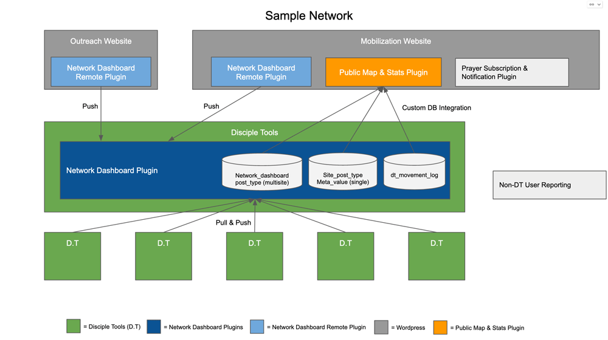

# Activity Log Collection
[Return to TOC](../README.md)

Activity Log has two modes of collection: Standard Cron Collection and Live Reporting.

###1. Standard Cron Collection
In the standard cron collection, the activity log is included in the daily snapshot. In this collection,
only standard prayer events from the local Disciple Tools system are included and some statistical arrays.

###2. Live Reporting
The Live Reporting is a mode that can be enabled in the admin area of the Network Dashboard. This adds a live reporting for real-time 
activity. Instead of relying on the cron process, the hooks POST immediately to the receiving Network Dashboard. This is
a reasonable and exciting option to enable in many network configurations, but where many dashboards being reported too the 
potential performance impact should be considered and monitored.

When live reporting is enabled, the activity log is not included in the daily cron collection. This is to avoid duplication. The 
Network Dashboard will check if live reporting is expected, and if so it will look to the movement_log for information submitted by
the site.

NOTE: If the Network Dashboard is primarily used for leadership insight and/or network solidarity, then the cron process
should provide enough current information for understanding he movement, but if you are powering a live prayer network
or some other implementation of leveraging live network activity, then consider the live reporting option. 

